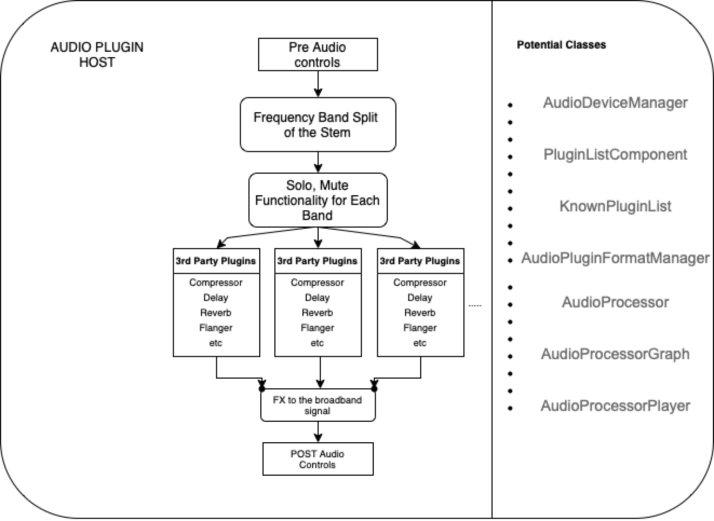

# Project Overview

## Motivation

Separating frequency bands and apply different FX chains on them is a tedious task, sometimes even impossible to do so in some DAWs. Yet it provides exciting possibilities, as shown by successful plugins like OTT and FabFilter Saturn 2. Multipass is a plugin that already provides such functionality. Unfortunately, it only supports loading plugins that also come from the same manufacturer: Kilohearts. If we can simply load third party plugins?

We are aiming to create an application that can split signals into frequency bands and provides interactive user interface to modify plugin parameters in real time and hear the effect. Here are some problems that we must solve:

- Designed to load self-contained effects and chain them up. Calculate latency compensation correctly.
- Scan VST plugins and allows users to select the VST they want to load.
- Store and load serialized plugin states.
- Create an interactive frequency band split widget.

## Applications, use cases, and target users 

The target users for our application involve any users with a broadband audio signal to process. This application will allow users to have access to a large variety of third-party plugins to apply to a range of bands within the application for optimal sound quality control. We hope to make the system easy to use, with minimal latency between band effects and an easy to understand UI. We see this mainly as a creative tool used by producers but can also extend its applications in corrective engineering of the tracks and mastering.

## UI Mock-up

- With the UI we have planned, the user will have control over the bandwidth of 4 frequency bands that the stem cab be split into
- They can adjust the gain of the input broadband signal
- Each Band of plugins have solo and mute functionality, with additional gain and pan
- POST the effects the user has control over the output gain and pan
- The user is presented with a level meter and information of latency that is a result of the plugin chains to the audio signal
- Each band can also be bypassed

## Functionality from user point of view and how it differentiates from similar products 

-	Split frequency bands
-	Scan and list plugins from third parties
-	Add plugins into plugin chain on each band
-	Pre & Post FX chain
-	Allows to adjust pan & volume & stereo separation (mid/side) of each band
-	Custom operation by users

## Plans for implementation

### Flow Chart

The flow chart already includes processor blocks.

### Needed components and potential need for 3rd-party libs

- Libraries for IIR filters.
- Visualization and UI.

## Algorithmic references 

- Frequency split algorithm 
  - [Linkwitz Riley Filter](https://docs.juce.com/master/classdsp_1_1LinkwitzRileyFilter.html): cascaded 2nd-order Butterworth Low pass filters.
  - [`sosfiltfilt`](https://docs.scipy.org/doc/scipy/reference/generated/scipy.signal.sosfiltfilt.html)

## General Responsibilities and Work Assignments

For specific assignments, we will follow traditional SCRUM procedures by dividing up the work once we arrive at the start of a new Sprint. The Github issues for specific issues for given milestones will have individuals assigned to the specific tasks. For now we have designated basic directions for what we will work on:

- UI development and integration with filters (still18)
- DSP for the audio effects, I/O for the application (nol-alb)
- Basic concept experiment & validation including loading plugins or effectors, creating effector chains, and latency compensation. (medioqrity, hchen605)

The SCRUM master will be rotated with sprints to allow for different perspectives at different stages.
