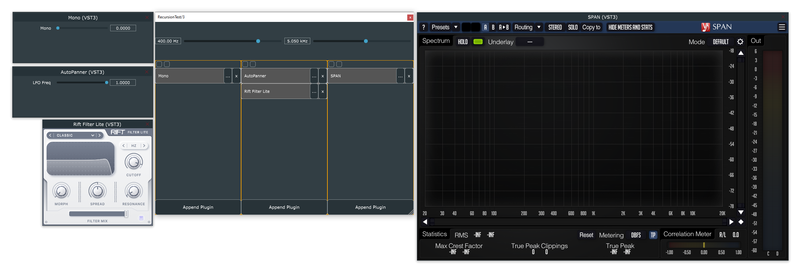
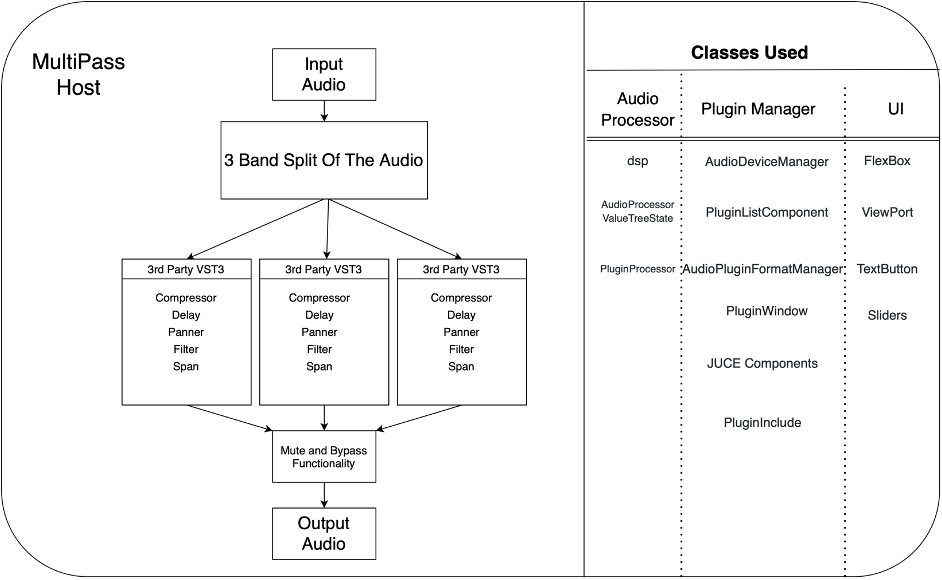
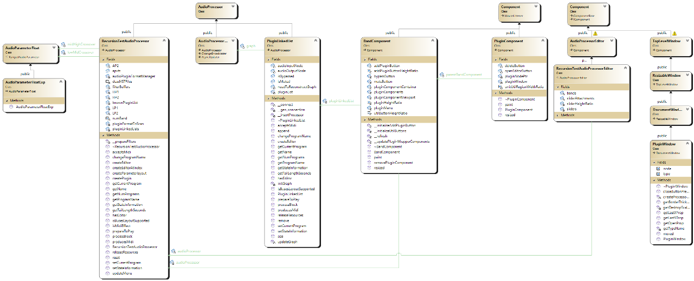

# Project Overview

### The Elevator Pitch
The MultiPass Plugin Host is an audio application and plugin that gives musicians the ability to split the input sound into 3 easily tweakable frequency bands and apply any number of 3rd party effects plugins into each band!

### Product Description

When you want to add effects to certain sounds on your compositional project it is not uncommon that you would like to apply the effects to only certain parts of the sound. For example, you would like to apply a panning effect just for the sub-bass frequency range keeping all the other bands stable, or you would like to apply distortion to make your high end stand out. Multiband processing adds a dimension to effect chains that really opens up a new world of options in sound design and creativity. 
“The MultiPass Plugin Host” Allows you to do this, letting you split the input sound into 3 easily tweakable frequency bands and applying any number of effects to each band.

## Applications, use cases, and target users 

The target users for our application involve any users with a broadband audio signal to process. This application will allow users to have access to a large variety of third-party plugins to apply to a range of bands within the application for optimal sound quality control. We hope to make the system easy to use, with minimal latency between band effects and an easy to understand UI. We see this mainly as a creative tool used by producers but can also extend its applications in corrective engineering of the tracks and mastering.

## UI

- With the UI we have planned, the user will have control over the bandwidth of 3 frequency bands that the stem cab be split into
- Addition of any number of vst3 plugins to each band
- Each Band has bypass and mute functionality
- 
## Functionality from user point of view and how it differentiates from similar products 

-	Split frequency bands
-	Scan and list plugins from third parties

## Plans for implementation

### Flow Chart

The flow chart already includes processor blocks.

### Class Structure

